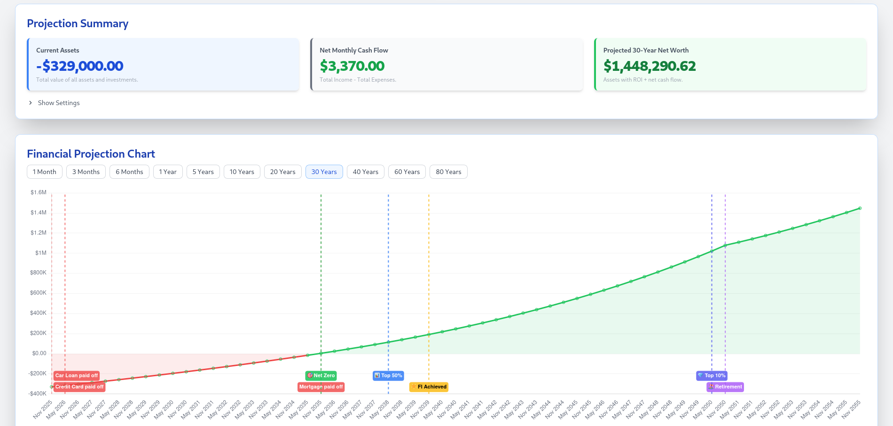

# Valenscope

Model your net worth over time. Tracks assets, debts, income, and expenses. Plan for retirement, financial independence, and other money milestones. Includes personalized financial insights powered by AI.

  

## How to use

Add your assets and debts to see your current net worth. Log your income and expenses to project changes over time. Set a goal, like retirement or financial independence, to see when you will reach it based on your current trajectory. View your net worth projection as a chart.

## How it works

Net worth projections and cash flow modeling run on your logged data. Personalized financial insights come from Gemini AI, based on your data. Charts render with Chart.js.

## License

This project uses the GPL-3.0 license. See the [LICENSE.md](LICENSE.md) file for details.